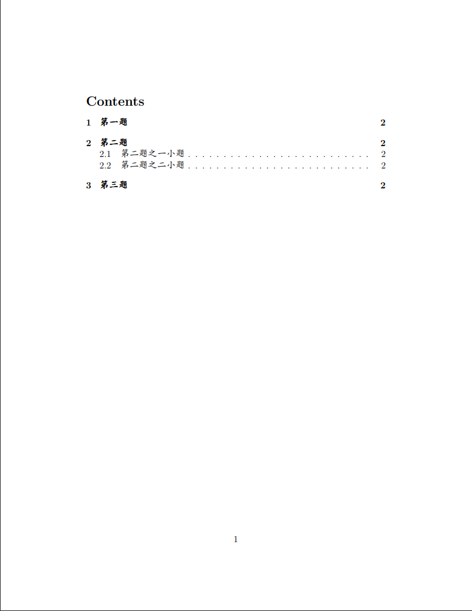

# NYCU_Overleaf_Template

In this repository, I provide some of the templates that I used in my master degree.

- [Powerpoint template](#powerpoint-template)
- [Homework template (zh)](#homework-template-zh)
- [Homework template (en)](#homework-template-en)

## Powerpoint template

<table>
    <tr>
        <th>
            
        </th>
        <th>
             
        </th>
    <tr>
    <tr>
        <th>
            
        </th>
        <th>
             
        </th>
    <tr>
</table>

## Homework template (zh)

<table>
    <tr>
        <th>
            
        </th>
        <th>
            
        </th>
        <th>
            
        </th>
    <tr>
</table>

## Homework template (en)

<table>
    <tr>
        <th>
            
        </th>
        <th>
            
        </th>
        <th>
            
        </th>
    <tr>
</table>